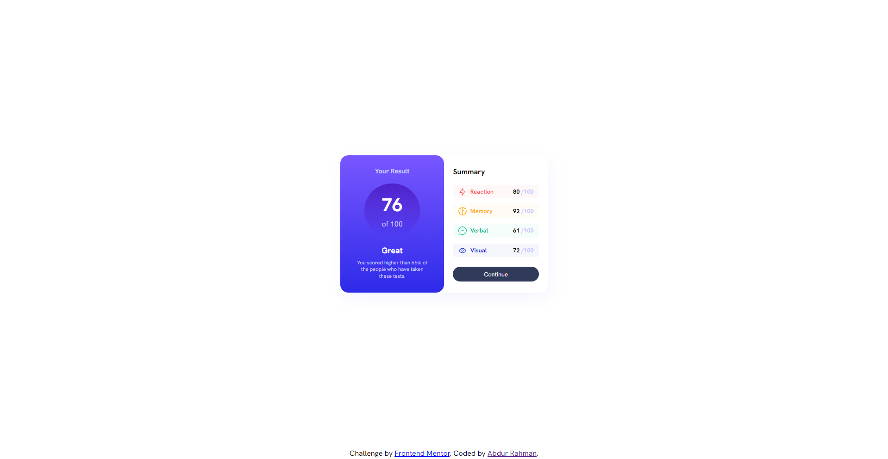

# Frontend Mentor - Results summary component solution

This is a solution to the [Results summary component challenge on Frontend Mentor](https://www.frontendmentor.io/challenges/results-summary-component-CE_K6s0maV). Frontend Mentor challenges help you improve your coding skills by building realistic projects.

## Table of contents

- [Overview](#overview)
  - [The challenge](#the-challenge)
  - [Screenshot](#screenshot)
  - [Links](#links)
- [My process](#my-process)
  - [Built with](#built-with)
  - [What I learned](#what-i-learned)
  - [Continued development](#continued-development)
- [Author](#author)

## Overview

### The challenge

Users should be able to:

- View the optimal layout for the interface depending on their device's screen size
- See hover and focus states for all interactive elements on the page
- **Bonus**: Use the local JSON data to dynamically populate the content

### Screenshot



### Links

- Solution URL: [Add solution URL here](https://github.com/nuraf9607/fm-results-summery-component)
- Live Site URL: [Add live site URL here](https://nuraf9607.github.io/fm-results-summery-component/)

## My process

### Built with

- Semantic HTML5 markup
- CSS custom properties
- Flexbox
- CSS Grid

### What I learned

By doing this project, I have gained a foundational understanding of web accessibility and incorporated ARIA tags to improve it. Additionally, I learned about the min() function in CSS, which helped streamline my code. Finally, I ventured into using CSS Grid, which was a new and rewarding experience.

```html
  <p class="card__summary-stat-value">
    61 <span class="gray-text">/100</span>
  </p>
```

```css
.card {
  width: min(100%, 28rem);
  margin: auto;
  display: grid;
  grid-template-columns: 1fr 1fr;
  box-shadow:6px 12px 30px 0px hsl(241, 100%, 89%, 0.2);
}
```

### Continued development

In future, I am considering to learn more about Web accessibility, more CSS properties, funcions and specifically Grid


## Author

- Frontend Mentor - [@yourusername](https://www.frontendmentor.io/profile/nuraf9607)
- Twitter - [@yourusername](https://x.com/theAbdurRahman1)


